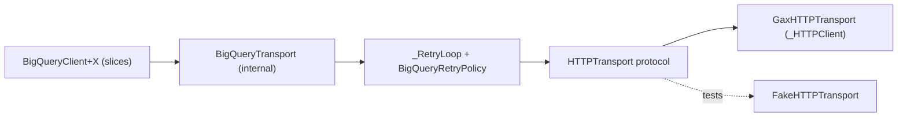

# BigQuery for Swift: design

Status: accepted for implementation. Owner: architect (swarm lead).

This document covers the Swift BigQuery library at
`pkgs/swift-google-cloud-bigquery`, module `GoogleCloudBigQuery`. It is a port
of the Java client (`java-bigquery/google-cloud-bigquery`).

It builds on three research documents:

- [bigquery_reference_behavior.md](bigquery_reference_behavior.md): the
  behavior doc, which describes the Java client. Referenced below as **B§n**.
- [bigquery_cross_language.md](bigquery_cross_language.md): the
  cross-language survey of Go, Python, Node, and Rust. Referenced as **S§n**.
- [bigquery_test_baseline.md](bigquery_test_baseline.md): every Java test
  with a stable ID (`U.<Class>.NN`, `IT-NNN`). Referenced as **T§n**.

## 1. Goals and non-goals

**Goals**

- Cover every operation on Java's `BigQuery` interface: datasets, tables,
  routines, models, jobs (query, load, extract, copy), the query fast path,
  stateless queries, `insertAll`, `listTableData`, table IAM, and the
  resumable writer.
- Provide an idiomatic Swift 6 API: `async`/`await`, value types,
  `AsyncSequence`, `Codable`, and typed IDs.
- Keep the generated wire layer and the HTTP plumbing internal.

**Non-goals (DEFERRED; see §11):**

- The Storage Read API and Arrow.
- The beta `Connection` API.
- OpenTelemetry.
- Schema inference from `Encodable`.
- Whole-query job retry.

## 2. Decisions

The coordinator made decisions D1–D5 (board #4), amended D2 (#12), and decided
the open questions in #8 and #17. Each is recorded here with its rationale.

| ID | Decision | Rationale |
| -- | -------- | --------- |
| D1 | Package `pkgs/swift-google-cloud-bigquery`, product and module `GoogleCloudBigQuery`. Same layout as `swift-google-cloud-storage`: `localOrRemotePackage` dependencies, shared `swiftSettings`, a `Tests` unit target, and a `Tests/IntegrationTests` target gated on `GOOGLE_CLOUD_PROJECT`. | One layout across the repository's hand-written veneers, so CI and the release tooling need no special cases. |
| D2 (amended, #12) | `librarian` generates `generated/swift-google-cloud-bigquery-v2` (module `GoogleCloudBigQueryV2`) from `google/cloud/bigquery/v2`. The veneer uses **only its message types**, as wire models, via a plain internal `import`. A hand-written internal `BigQueryTransport` on `GoogleGax._HTTPClient` + `_RetryLoop` sends the requests. | Spike results (§2.1). |
| D3 | One `BigQueryClient` with async methods; value-type resources and configs (no builders); typed IDs; `AsyncSequence` for lists and rows; typed row access plus `Decodable` decoding; one error type; resumable upload. Internals stay internal and are tested with `@testable import`. | Idiomatic Swift. Repository rule (GEMINI.md): never raise visibility for tests. |
| D4 | Scope is all of Java's `BigQuery` interface. The Read API, Arrow, Connection, and OTel are DEFERRED. | S§4. There is no generated Storage v1 module and no Swift Arrow dependency in the repository. |
| D5 | Swift Testing only. Unit tests cover the Java unit baseline. ITs cover the Java IT baseline and run live against `GOOGLE_CLOUD_PROJECT`, with unique resource names and cleanup. | T§1. |
| #8-Q1 | Job-creation mode is **unset by default**. It is available as `QueryJobConfiguration.jobCreationMode` and as the client default `BigQueryClientOptions.defaultJobCreationMode`. The client never opts into `JOB_CREATION_OPTIONAL` silently. | Java parity (B§1). Optional mode changes which IDs are returned, so it should be an explicit choice. |
| #8-Q2 | `insertAll` generates a UUID `insertId` for every row that lacks one. Callers can supply their own IDs or opt out with `InsertAllOptions.insertIDs = .none`; opting out also disables retries. | Retries without insert IDs can duplicate rows. Go, Python, and Node all do this. **Intentional difference from Java**, which sends no IDs. |
| #8-Q3 | Cancelling the Swift `Task` only stops waiting or paging. It never sends `jobs.cancel`; server-side cancel is the explicit `cancelJob(_:)`. | A client-side task lifetime should not have server-side side effects. |
| S§3 #1 | Every query sends `useLegacySql=false`, including view definitions. When a value read back from the server is absent, it means legacy SQL (`true`). | The server default is legacy SQL. Java's builders also default to standard SQL. |
| S§3 #2 | Every `jobs.query`, `getQueryResults`, and `tabledata.list` request sets `formatOptions.timestampOutputFormat=ISO8601_STRING` (`Internal/RowFormat.swift`). | Without `formatOptions`, timestamps come back as float seconds and lose precision; `useInt64Timestamp=true` truncates picoseconds on `TIMESTAMP(12)` columns. `ISO8601_STRING` preserves full microsecond and picosecond precision. |
| S§3 #3 | Every `jobs.query` request carries a `requestId`. Job IDs are always generated client-side. | Makes the create calls idempotent, so they are safe to retry (B§2 "Idempotency and job IDs"). |
| S§3 #4 | The fast-path decision uses an **allowlist** (§6.2). | Java uses a denylist, so any new configuration field it doesn't know about silently takes the fast path. |
| S§3 #5 | Retries follow §5.2. | Reason-based classification is more robust than Java's message regex (B§2, and verifier #13 item 7). |
| S§3 #6 | Rows are paged lazily. `totalRows` is `UInt64?`, and the client never infers "no rows" from an absent count. | Rust's bug (S§3). |
| S§3 #13 | Waiting for a job throws when the job failed. | Go's footgun (S§3). |
| S§3 #14 | `BIGNUMERIC` uses a string-backed `BigNumeric` type. | Foundation `Decimal` has 38 digits; BIGNUMERIC needs 76.76. |
| #12 | No GitHub issues are filed. Upstream bugs go in §13. The `qualifier_encoded` skip lives in `librarian.yaml` (config only). | Coordinator. |
| #17 | ITs create and delete their own GCS bucket. *Changed by the architect:* the bucket helper (`Tests/IntegrationTests/Support/CloudStorage.swift`) calls the GCS JSON API through the client's own transport instead of depending on `swift-google-cloud-storage`, because that package pulls gRPC into every `swift test` build of this package. Connection and remote-UDF ITs are gated on `BIGQUERY_TEST_CONNECTION_ID`. Resource names follow `swift_bq_it_<date>_<hex>`. The janitor may only delete `swift_bq_it_*` resources older than 24 h. Test rows are generated with SQL; the 12 MB CSV is not vendored. | Coordinator. |

### 2.1 D2 spike evidence

These results are from the spike, committed as `bb524d2c7e`.

- **Generation.** `librarian generate google-cloud-bigquery-v2` produces
  `GoogleCloudBigQueryV2`, and it builds with `-warnings-as-errors`. One
  config change was needed: `skipped_ids:
  [.google.cloud.bigquery.v2.BigtableColumn.qualifier_encoded]`. That field
  is a `BytesValue`, and the generator does not emit the `public import
  Foundation` it needs (§13, item 3).
- **The generated client cannot be used as-is.** We use only its messages,
  for three reasons:
  1. The generated `ServiceError` drops BigQuery's
     `error.errors[{reason, location, message, debugInfo}]`. Only the code,
     the message, and `google.rpc` details survive. The design requires the
     reason (§5.1).
  2. A `DELETE` returns `204` with an empty body and
     `content-type: application/json`. The generated client then throws a
     JSON decode error even though the delete succeeded (confirmed with
     `curl`).
  3. The generated stubs and transport are `internal` to the generated
     module, so they cannot be wrapped or tested through a fake. The protos
     also lack `tabledata.list`/`insertAll`, the table IAM mixin, and the
     upload endpoint, so a hand-written transport is needed anyway (the same
     gap Rust has; S§3).
- **The messages work for BigQuery's JSON quirks.** The spike ran these live:
  - Wrapper types (`Int64Value`, `BoolValue`, ...) map to Swift optionals.
  - `tabledata.list` and `jobs.query` rows decode as
    `[GoogleWKT.WKTStruct]`, which keeps the `{"f":[{"v":...}]}` shape.
  - `QueryParameterValue` round-trips, including `arrayValues`,
    `structValues`, and `rangeValue`.
  - Stateless queries return `jobReference == nil` plus a `queryId`.
  - Schemas come back with legacy type names (`INTEGER`, `RECORD`) even when
    the request used `INT64`.
- **Encoding behavior.** `_ProtoJSONEncoder` omits `nil` optionals and empty
  collections. It **does** emit proto3 scalar defaults for non-wrapper
  fields: `""`, `"0"`, and `*_UNSPECIFIED` enum values. The server accepted
  these on `datasets.insert` and `tables.insert`. §5.4 explains how PATCH
  handles them.

## 3. Package and module layout

```
pkgs/swift-google-cloud-bigquery/
  Package.swift                     deps: auth, gax, wkt, bigquery-v2, iam-v1 (internal wire only),
                                    swift-log, NIOCore, NIOHTTP1;
  Sources/GoogleCloudBigQuery/
    # ---- core (architect) ----
    BigQueryClient.swift            client class, init, project/location resolution
    BigQueryProtocol.swift          protocol seam + default witnesses + convenience overloads
    BigQueryClientOptions.swift
    BigQueryError.swift
    BigQueryRetryPolicy.swift       public, mirrors StorageBaseRetryPolicy
    ResourceIDs.swift               DatasetID, TableID, RoutineID, ModelID
    JobID.swift
    PagedSequence.swift             generic lazy pagination (+ Page, PagedSequence.Pages)
    RowSequence.swift               rows AsyncSequence (+ schema, totalRows)
    Schema.swift                    Schema, Field, FieldType
    Row.swift                       Row, FieldValue (lossless cell model + f/v parsing)
    SharedConfigurations.swift      EncryptionConfiguration, TimePartitioning,
                                    RangePartitioning, Clustering, JobCreationMode
    DataFormat.swift                DataFormat, CSVOptions, ParquetOptions, AvroOptions,
                                    HivePartitioningOptions (shared by tables + load jobs)
    QueryParameter.swift            shell of QueryParameters / QueryParameterValue (slice 2 grows it)
    Internal/
      HTTPTransport.swift           HTTPRequest/HTTPResponse + protocol (test seam)
      GaxHTTPTransport.swift        production implementation over _HTTPClient
      BigQueryTransport.swift       retry loop, error mapping, JSON decode, 404→nil, 204
      RequestBody.swift             proto-JSON body + explicit-null overrides (PATCH)
      ProjectDiscovery.swift
      RowFormat.swift               shared formatOptions.timestampOutputFormat=ISO8601_STRING
      Wire+Core.swift               IDs/Schema/configs <-> GoogleCloudBigQueryV2
    # ---- slice files: see §10 ----
  Tests/                            unit tests (Swift Testing), Support/FakeHTTPTransport.swift
  Tests/IntegrationTests/           live tests, Support/IntegrationTestSupport.swift
```

**Public dependencies.** The public API exposes only `GoogleGax`
(`ClientOptions`, `RequestOptions`, `RetryPolicy`) via `public import`, as
storage does. `GoogleCloudBigQueryV2`, `GoogleIAMV1`, and `GoogleWKT` are
plain internal imports. No generated type appears in the public API. Table
IAM uses the veneer's own `IAMPolicy` (§4.7), so generated-package churn
cannot break callers.

## 4. Public API sketch

All public types are `Sendable`. Value types are `Equatable` (and `Hashable`
when every field allows it). Every type that a method returns has a `public
init`, so tests can build test doubles. Each slice may add fields, but must
not rename anything listed here without posting to the board first.

### 4.1 Client and options (core)

```swift
public final class BigQueryClient: Sendable {
  public static let defaultEndpoint = "https://bigquery.googleapis.com"
  public let projectID: String          // resolved at init (§4.9)
  public let location: String?          // default job location
  public init(_ options: BigQueryClientOptions = .init()) throws
}

public struct BigQueryClientOptions: Sendable {
  public var client: GoogleGax.ClientOptions   // endpoint, credentials, retry/backoff, logger…
  public var projectID: String?
  public var location: String?
  public var defaultJobCreationMode: JobCreationMode?
  public init()
  public func with(_ config: (inout Self) throws -> Void) rethrows -> Self
}
```

Every RPC method ends with `options: GoogleGax.RequestOptions = .init()`. This
lets a caller override retry, timeout, idempotency, or headers per call, the
same way storage and the generated clients do.

`BigQueryClientOptions()` defaults `client.attemptTimeout` to 60 s (Java's
read timeout; the gax default is 15 s).

### 4.2 IDs (core)

```swift
public struct DatasetID: Sendable, Hashable, CustomStringConvertible {
  public var projectID: String?         // nil → client project
  public var datasetID: String
  public init(projectID: String? = nil, datasetID: String)
  public init(_ string: String) throws  // "dataset" or "project.dataset" or "project:dataset"
  public func table(_:) -> TableID; func routine(_:) -> RoutineID; func model(_:) -> ModelID
}
public struct TableID  { projectID?, datasetID, tableID; init(projectID:datasetID:tableID:),
                         init(dataset: DatasetID, tableID:), init(_ "p.d.t" | "d.t") throws,
                         var datasetReference: DatasetID; var iamResourceName (internal) }
public struct RoutineID { projectID?, datasetID, routineID; same shape }
public struct ModelID   { projectID?, datasetID, modelID;   same shape }
public struct JobID     { projectID?, jobID: String, location: String?
                          init(projectID:jobID:location:); static func random(…) -> JobID }
```

`description` uses the Standard SQL form: `project.dataset.table`.

### 4.3 Errors (core)

```swift
public struct BigQueryError: Error, Sendable, Hashable, CustomStringConvertible {
  public struct Kind: Sendable, Hashable { service, job, invalidArgument, timeout }   // extensible
  public struct Detail: Sendable, Hashable { reason, location, message, debugInfo: String? }
  public var kind: Kind
  public var message: String
  public var httpStatusCode: Int?       // HTTP status when the error came from a response
  public var status: String?            // e.g. "NOT_FOUND"
  public var errors: [Detail]           // every entry of error.errors[] / job errors[]
  public var jobID: JobID?              // kind == .job (and service errors about a job)
  public var reason: String? { get }    // errors.first?.reason
  public var location: String? { get }
  public var isNotFound: Bool { get }
  public init(kind:message:httpStatusCode:status:errors:jobID:)
}
```

- **`.service`:** the server returned a non-2xx status. The error body is
  parsed as `{"error":{"code","message","status","errors":[...]}}`.
- **`.job`:** a job or query failed — either with `status.errorResult` (or
  `errors` in a `jobs.query` or `getQueryResults` response), or with an HTTP
  400/403/404/409 rejection from `jobs.query` or `jobs.insert` inside
  `query(_:)`, so `query(_:)` surfaces the same error kind on both the fast
  and slow paths. `errors` holds `errorResult` first, followed by
  `status.errors` (or the HTTP `error.errors[]`). `jobID` is set when a job ID
  is known.
- **`.invalidArgument`:** client-side validation. Examples: no project could
  be resolved, `dryRun` was passed to `query`, or an invalid ID string.
- **Other errors propagate unchanged:** transport, authentication, and retry
  exhaustion surface as `GoogleGax.RequestError` (`.io`, `.binding`,
  `.exhausted`, `.malformedResponse`). Cancellation surfaces as
  `CancellationError`. This matches storage, so a caller can still catch
  network failures generically.
- **Exhaustion is unwrapped.** A persistent HTTP error surfaces as
  `BigQueryError(.service)` whichever limit stops the retry loop. When the
  attempt limit trips, gax rethrows the last `.http` error; when the
  elapsed-time limit trips, it wraps it as
  `.exhausted(.elapsedTime(source: .http))`. `BigQueryTransport` unwraps both
  to `BigQueryError(.service)`. A unit test pins this.

### 4.4 Pagination and rows (core)

```swift
public struct Page<Element: Sendable>: Sendable { public var items: [Element]; public var nextPageToken: String? }
public struct PagedSequence<Element: Sendable>: AsyncSequence, Sendable {
  public init(fetch: @escaping @Sendable (_ pageToken: String?) async throws -> Page<Element>)
  public init(firstPage: Page<Element>, fetch: ...)     // first page already fetched
  public init(_ items: [Element])                        // test doubles
  public var pages: Pages { get }                        // AsyncSequence of Page<Element>
  public struct Pages: AsyncSequence, Sendable { … }
  public func collect() async throws -> [Element]
}
public struct RowSequence: AsyncSequence, Sendable {     // Element == Row
  public let schema: Schema              // empty when the result has no schema
  public let totalRows: UInt64?          // nil when the server did not say
  public var pages: PagedSequence<Row>.Pages { get }
  public init(schema: Schema, totalRows: UInt64?, rows: PagedSequence<Row>)
  public init(schema: Schema, rows: [Row])               // test doubles
  public func collect() async throws -> [Row]
  // slice 2 adds: func decode<T: Decodable>(_: T.Type) -> some AsyncSequence<T, any Error>
}
```

**Why not reuse gax's `PaginatedResponseSequence`?** It is
`@_spi(GoogleCloudInternal)`, so it cannot appear in a public signature
without making callers import SPI. It also requires the response type to
conform to the SPI `_PaginatedResponse`, and it cannot start from an
already-fetched first page (the fast-path query response). The behavior is
the same: empty intermediate pages are skipped (AIP-158) and an empty token
ends the sequence.

Every list method also takes `pageToken: String? = nil`, so a caller can
resume from `Page.nextPageToken`.

An empty `nextPageToken` (`""`, the proto3 default) means there are no more
pages. Each page fetch goes through the retry loop.

### 4.5 Schema and values (core: structure; slice 2: typed access)

```swift
public struct Schema: Sendable, Hashable { public var fields: [Field]; init(_ fields: [Field]);
                                           subscript(name: String) -> Field?; func index(of: String) -> Int? }
public struct Field: Sendable, Hashable {
  public var name: String; public var type: FieldType; public var mode: Mode?   // nil = NULLABLE
  public var fields: [Field]            // STRUCT subfields
  public var description, collation, defaultValueExpression: String?
  public var maxLength, precision, scale, timestampPrecision: Int64?; public var roundingMode: RoundingMode?
  public var rangeElementType: FieldType?; public var policyTags: [String]?
  public init(_ name: String, _ type: FieldType, mode: Mode? = nil, fields: [Field] = [], description: String? = nil)
  public struct Mode: RawRepresentable, Sendable, Hashable { nullable, required, repeated }
  public struct RoundingMode: RawRepresentable … { roundHalfAwayFromZero, roundHalfEven }
}
public struct FieldType: RawRepresentable, Sendable, Hashable {   // normalised Standard SQL names
  string, bytes, int64, float64, numeric, bigNumeric, bool, timestamp, date, time, dateTime,
  geography, json, interval, range, `struct`
}
public struct Row: Sendable, Equatable {
  public let schema: Schema; public let values: [FieldValue]
  public subscript(index: Int) -> FieldValue
  public subscript(name: String) -> FieldValue?   // exact match first, then case-insensitive (U.FieldList.01)
}
public enum FieldValue: Sendable, Equatable { case null, scalar(String), array([FieldValue]), record(Row) }
// slice 2: non-throwing shape-unwrapping accessors (nil for NULL or non-matching shape):
//   var stringValue: String?, jsonValue: String?, geographyValue: String?,
//   arrayValue: [FieldValue]?, recordValue: Row?
// slice 2: parsed accessors (nil for NULL, throw on parse/shape mismatch), e.g.
//   var int64Value: Int64? { get throws }, doubleValue, boolValue, bytesValue,
//   numericValue: Decimal?, bigNumericValue: BigNumeric?,
//   timestampValue: Date?, timestampMicros: Int64?, preciseTimestampValue: BigQueryTimestamp?,
//   dateValue: BigQueryDate?, timeValue: BigQueryTime?, dateTimeValue: BigQueryDateTime?,
//   intervalValue: Interval?, rangeValue: BigQueryRange?
// slice 2: Row.decode<T: Decodable>(_:) throws -> T
```

**Type names.** Legacy names are normalized when a schema is decoded:
`INTEGER`→`INT64`, `FLOAT`→`FLOAT64`, `BOOLEAN`→`BOOL`, `RECORD`→`STRUCT`,
`DECIMAL`→`NUMERIC`, `BIGDECIMAL`→`BIGNUMERIC`. The client sends Standard SQL
names. This is an **intentional difference** from Java, which exposes
`LegacySQLTypeName`. Swift has no legacy SQL mode, so there is one name per
type.

**Cell parsing** (`FieldValue(wire:field:)`, core):

| Cell | Result |
| ---- | ------ |
| A REPEATED field | `.array`. Each element is parsed **with the field's schema** in NULLABLE mode. A `null` array becomes `[]` (S§3 #16). |
| A STRUCT field | `{"f":[...]}` becomes `.record(Row)` with the subfield schema. |
| Anything else | A string becomes `.scalar`, and `null` becomes `.null`. |

This fixes Java's bug where REPEATED cells are parsed with a null schema,
so `get(name)` fails on `ARRAY<STRUCT>` elements and `ARRAY<RANGE>` elements
come back as plain strings (B§6). **Intentional difference.**

### 4.6 Shared configurations (core)

```swift
public struct EncryptionConfiguration { public var kmsKeyName: String? }
public struct TimePartitioning { type: PartitionType (.day/.hour/.month/.year, extensible), field: String?,
                                 expiration: Duration?, requirePartitionFilter: Bool? }
public struct RangePartitioning { field: String; range: Range { start, end, interval: Int64 } }
public struct Clustering { fields: [String] }
public struct JobCreationMode: RawRepresentable { required, optional }
public struct DataFormat: RawRepresentable { csv, json (NEWLINE_DELIMITED_JSON), avro, parquet, orc,
                                             datastoreBackup, googleSheets, bigtable, iceberg }
public struct CSVOptions { allowJaggedRows, allowQuotedNewlines: Bool?; encoding, fieldDelimiter, quote,
                           nullMarker: String?; nullMarkers: [String]?; skipLeadingRows: Int64?;
                           preserveASCIIControlCharacters: Bool?; sourceColumnMatch: String? }
public struct ParquetOptions { enableListInference, enumAsString: Bool?; mapTargetType: String? }
public struct AvroOptions { useAvroLogicalTypes: Bool? }
public struct HivePartitioningOptions { mode: String?; sourceURIPrefix: String?;
                                        requirePartitionFilter: Bool?; fields: [String]? (output) }
```

### 4.7 Resources and methods (slices)

**Signature rules for every slice:**

- Every RPC method ends with `options: RequestOptions = .init()`. Other
  inputs are labeled parameters with defaults; there are no options structs
  for per-call flags.
- `get*` and `list*` methods take `selectedFields: [String]? = nil`, a list
  of BigQuery field-selector names. The client always adds the required
  fields from B§4 "Common rules".
- `list*` methods take `pageSize: Int? = nil, pageToken: String? = nil` and
  return `PagedSequence`.
- Every enum-like value from the server is an extensible
  `RawRepresentable` struct with static constants, so an unknown wire value
  degrades gracefully. This covers JobState, TableType, Priority,
  dispositions, DatasetView, TableMetadataView, DatasetUpdateMode, DataFormat,
  and similar.
- The only public `enum`s are closed shapes that cannot grow:
  `FieldValue` (the four wire cell shapes), `QueryParameters` (named or
  positional), and `JobConfiguration` (the four job types).
  `Job.configuration` is `nil` for a job type the client does not know.

```swift
// ---- slice 1: datasets, routines, models, table IAM, service account ----
public struct Dataset { id: DatasetID; friendlyName, description, location: String?; labels: [String: String]?;
  defaultTableExpiration, defaultPartitionExpiration: Duration?; access: [Acl]?; defaultEncryption…;
  defaultCollation; maxTimeTravel; storageBillingModel; isCaseInsensitive; tags; externalDatasetReference…;
  /* output */ etag, creationTime, lastModifiedTime, selfLink: …? ; struct Field (clearable fields) }
@discardableResult func createDataset(_ dataset: Dataset, accessPolicyVersion: Int32? = nil, options:) async throws -> Dataset
func getDataset(_ id: DatasetID, view: DatasetView? = nil, accessPolicyVersion: Int32? = nil,
                selectedFields: [String]? = nil, options:) async throws -> Dataset?          // nil on 404
func listDatasets(projectID: String? = nil, all: Bool = false, filter: String? = nil,
                  pageSize: Int? = nil, pageToken: String? = nil, options:) -> PagedSequence<Dataset>
func updateDataset(_ dataset: Dataset, clearing: Set<Dataset.Field> = [], updateMode: DatasetUpdateMode? = nil,
                   ifMatch etag: String? = nil, options:) async throws -> Dataset            // PATCH
@discardableResult func deleteDataset(_ id: DatasetID, deleteContents: Bool = false, options:) async throws -> Bool
// Routine: @discardableResult create / get / list / update(PUT) / delete; Model: get / list / update(PATCH, clearing:) / delete (no create)
public struct IAMPolicy { version: Int32?; bindings: [Binding { role, members: [String], condition: Expr? }];
                          etag: Data? }
func getIAMPolicy(for table: TableID, requestedPolicyVersion: Int32? = nil, options:) async throws -> IAMPolicy
func setIAMPolicy(_ policy: IAMPolicy, for table: TableID, options:) async throws -> IAMPolicy
func testIAMPermissions(_ permissions: [String], for table: TableID, options:) async throws -> [String]
func getServiceAccount(projectID: String? = nil, options:) async throws -> String              // P1

// ---- slice 2: values, parameters, insertAll ----
public enum QueryParameters { case named([String: QueryParameterValue]), positional([QueryParameterValue]) }
public struct QueryParameterValue { static func string/int64/float64/bool/bytes/numeric/bigNumeric/timestamp/
  date/time/dateTime/json/geography/interval/range/array/struct…; static func null(_ type: FieldType) }
public protocol QueryParameterConvertible { var queryParameterValue: QueryParameterValue { get } }
public struct InsertRow { insertID: String?; init<T: Encodable>(_ value: T, insertID: String? = nil) throws;
                          init(_ values: [String: InsertValue], insertID: String? = nil) }
public struct InsertIDPolicy: RawRepresentable { generateMissing (default), none }
public struct InsertAllResponse { rowErrors: [Int: [BigQueryError.Detail]]; var hasErrors: Bool }
func insertAll(_ rows: [InsertRow], into table: TableID, skipInvalidRows: Bool = false,
               ignoreUnknownValues: Bool = false, templateSuffix: String? = nil,
               insertIDs: InsertIDPolicy = .generateMissing, options:) async throws -> InsertAllResponse
func insertAll<T: Encodable>(_ values: some Sequence<T>, into table: TableID, skipInvalidRows: Bool = false,
                             ignoreUnknownValues: Bool = false, templateSuffix: String? = nil,
                             insertIDs: InsertIDPolicy = .generateMissing,
                             options:) async throws -> InsertAllResponse
// value types: BigNumeric, BigQueryTimestamp, BigQueryDate, BigQueryTime, BigQueryDateTime, Interval, BigQueryRange

// ---- slice 3: tables, table data ----
public struct Table { id: TableID; friendlyName, description: String?; labels; expirationTime: Date?;
  schema: Schema?; timePartitioning; rangePartitioning; clustering; encryption; requirePartitionFilter;
  view: ViewDefinition?; materializedView: MaterializedViewDefinition?;
  externalDataConfiguration: ExternalDataConfiguration?; snapshotDefinition; cloneDefinition;
  tableConstraints; defaultCollation; resourceTags; biglakeConfiguration…;
  /* output */ type: TableType?, etag, numBytes, numRows, numLongTermBytes, creationTime, lastModifiedTime,
  location, streamingBuffer…; struct Field (clearable) }
@discardableResult func createTable(_ table: Table, options:) async throws -> Table
func getTable(_ id: TableID, view: TableMetadataView? = nil, selectedFields: [String]? = nil, options:) async throws -> Table?
func listTables(in dataset: DatasetID, pageSize: Int? = nil, pageToken: String? = nil, options:) -> PagedSequence<Table>
func updateTable(_ table: Table, clearing: Set<Table.Field> = [], autodetectSchema: Bool = false,
                 ifMatch etag: String? = nil, options:) async throws -> Table
@discardableResult func deleteTable(_ id: TableID, options:) async throws -> Bool
func listRows(in table: TableID, schema: Schema? = nil, selectedFields: [String]? = nil,
              startIndex: UInt64? = nil, pageSize: Int? = nil, pageToken: String? = nil,
              options:) async throws -> RowSequence
//   schema == nil → one extra tables.get(selectedFields: schema) first (Δ, see §7)
func listPartitions(of table: TableID, options:) async throws -> [String]

// ---- slice 4: jobs, query, load/extract/copy, upload ----
public enum JobConfiguration { case query(QueryJobConfiguration), load(LoadJobConfiguration),
                               extract(ExtractJobConfiguration), copy(CopyJobConfiguration) }
public struct Job { id: JobID; configuration: JobConfiguration?; status: JobStatus; statistics: JobStatistics?;
                    userEmail, etag, selfLink: String? }
func createJob(_ configuration: JobConfiguration, id: JobID? = nil, selectedFields: [String]? = nil,
               options:) async throws -> Job
@discardableResult func runJob(_ configuration: JobConfiguration, id: JobID? = nil, timeout: Duration? = nil,
                               options:) async throws -> Job     // createJob + waitForJob
func getJob(_ id: JobID, selectedFields: [String]? = nil, options:) async throws -> Job?   // failed job is returned, not thrown
func listJobs(projectID: String? = nil, allUsers: Bool = false, stateFilter: Set<JobState> = [],
              parentJob: JobID? = nil, minCreationTime: Date? = nil, maxCreationTime: Date? = nil,
              selectedFields: [String]? = nil, pageSize: Int? = nil, pageToken: String? = nil,
              options:) -> PagedSequence<Job>
@discardableResult func cancelJob(_ id: JobID, options:) async throws -> Bool
@discardableResult func deleteJob(_ id: JobID, options:) async throws -> Bool
@discardableResult func waitForJob(_ id: JobID, timeout: Duration? = nil, options:) async throws -> Job
//   throws .job on errorResult; timeout only stops waiting (never cancels the job)
func query(_ configuration: QueryJobConfiguration, jobID: JobID? = nil, projectID: String? = nil,
           location: String? = nil, timeout: Duration? = nil, options:) async throws -> QueryResult
//   jobID given → slow path with exactly that ID; otherwise projectID/location override the client
//   defaults for both paths (Java's "JobId without a job name")
func query(_ sql: String, parameters: QueryParameters? = nil, pageSize: Int? = nil,
           options:) async throws -> QueryResult
func getQueryResults(_ job: JobID, startIndex: UInt64? = nil, pageSize: Int? = nil, options:) async throws -> QueryResult
func dryRun(_ configuration: QueryJobConfiguration, projectID: String? = nil, location: String? = nil,
            options:) async throws -> QueryDryRunResult       // statistics + schema + referenced tables
func dryRun(_ sql: String, parameters: QueryParameters? = nil, options:) async throws -> QueryDryRunResult
func load(_ source: UploadSource, configuration: LoadJobConfiguration, jobID: JobID? = nil,
          chunkSize: Int = 15 << 20, options:) async throws -> Job      // resumable upload (Java writer)
public struct QueryResult {
  schema: Schema?                 // nil iff the final response has no schema (DDL, some scripts)
  totalRows: UInt64?              // rows in the result set only; never DML counts (Δ)
  numDMLAffectedRows: Int64?; dmlStats: DMLStats?
  jobID: JobID?; queryID: String?; location: String?
  cacheHit: Bool?; statementType: StatementType?; jobCreationReason: String?
  totalBytesProcessed: Int64?; totalBytesBilled: Int64?; totalSlotMs: Int64?
  sessionInfo: SessionInfo?; creationTime, startTime, endTime: Date?
  rows: RowSequence               // empty when schema == nil
}
```

**insertAll JSON encoding** (`InsertRow(_ value: some Encodable)`, slice 2):

The row is encoded to a JSON object with a dedicated encoder. A plain
`JSONEncoder` is not used, because its default `Date` encoding (seconds since
2001) is wrong for BigQuery.

| Swift value | JSON |
| ----------- | ---- |
| `Date`, `BigQueryTimestamp` | an RFC 3339 UTC string (`Date` with microseconds; `BigQueryTimestamp` with up to 12 fractional digits) |
| `Data` | base64 |
| `Decimal`, `BigNumeric` | an exact decimal string |
| Integers | a JSON number when \|v\| ≤ 2^53, otherwise a decimal string |
| `Double` / `Float` | a number. `NaN` and `±Infinity` become the strings `"NaN"`, `"Infinity"`, `"-Infinity"` |
| `Bool` | a boolean |
| Civil types and `Interval` | their canonical BigQuery string |
| Nested `Encodable` | a JSON object (STRUCT) |
| Arrays | JSON arrays |
| `nil` | the key is omitted, never `null` |

The `[String: InsertValue]` initializer follows the same rules.

### 4.8 Mock seam

The protocol shape is decided now, so the slices can freeze their
signatures. At the integration step, the architect adds
`public protocol BigQueryProtocol: Sendable` and `BigQueryClient` conforms to
it. Slices do not touch it. It follows the `StorageProtocol` pattern:

- Each protocol requirement lists the **full** parameter list, with no
  defaults (protocols cannot have them).
- An `extension BigQueryProtocol` provides:
  - a default implementation of each requirement that throws
    `RequestError.unimplemented`, so a test double implements only what it
    needs;
  - forwarding overloads that carry the default arguments, so
    `any BigQueryProtocol` reads the same as the concrete client.
- `BigQueryClient`'s own methods keep their default arguments. On the
  concrete type they are preferred over the extension overloads.

The protocol requirements use non-generic value types (`[InsertRow]` and
`UploadSource`) and avoid variadic parameters; the generic
`insertAll<T: Encodable>(_ values: some Sequence<T>, ...)` convenience on
`BigQueryClient` maps elements through `InsertRow(_:)` and forwards to the
`[InsertRow]` method.

### 4.9 Project and location resolution

The project ID is taken from the first source that provides one:

1. `options.projectID`.
2. The `GOOGLE_CLOUD_PROJECT` environment variable.
3. The `GCLOUD_PROJECT` environment variable.
4. `project_id` in the JSON file named by `GOOGLE_APPLICATION_CREDENTIALS`.

If none of these yields a project, `init` throws
`BigQueryError(kind: .invalidArgument)`. Java also checks App Engine, the
gcloud config, and the metadata server (B§1). `swift-google-auth` exposes no
project discovery, so those sources are follow-ups (§13).

An ID with a `nil` project uses the client project. A `JobID` with a `nil`
location uses the client location, for get, cancel, getQueryResults,
delete, and generated IDs. Datasets never inherit the client location (B§1).

## 5. Transport, errors, retries, request bodies

### 5.1 Layers



- **`HTTPTransport`** is an internal protocol:
  `send(HTTPRequest, timeout:) async throws -> HTTPResponse`.
  - `HTTPRequest` holds the method, the path (percent-encoded and relative
    to the endpoint) **or** an absolute URL (for upload sessions), the query
    items, the headers, the body (`Data`), and the per-call `RequestOptions`.
  - `HTTPResponse` holds the status code, the headers (case-insensitive),
    and the body (`Data`).
  - Unit tests inject `FakeHTTPTransport` through the internal
    `BigQueryClient(projectID:location:transport:)` init.
- **`BigQueryTransport`** does the following:
  - Adds `prettyPrint=false`.
  - Runs `_RetryLoop(options:withDefault:idempotent:)`.
  - Inside each attempt, turns a non-2xx response into
    `RequestError.http(HTTPDetails)`, so both `BigQueryRetryPolicy` and any
    user-supplied `RetryPolicy` can classify it.
  - After the loop, maps an `.http` error to `BigQueryError(kind: .service)`.
  - Decodes 2xx bodies with `_ProtoJSONDecoder`. A `204` or empty body is
    never decoded.
  - Exposes `json(_:)`, `jsonOrNil(_:)` (404 → `nil`), `send(_:)` (2xx only),
    and `deleteOrFalse(_:) -> Bool` (404 → `false`).

### 5.2 Retry policy

`public struct BigQueryRetryPolicy: RetryPolicy` mirrors
`StorageBaseRetryPolicy`:

```swift
BigQueryRetryErrors().retryOnIO().strictIdempotency()
```

Its `defaultPolicy` is `unbounded().withTimeLimit(.seconds(50)).withAttemptLimit(6)`,
which matches Java's 6 attempts and 50 s total. The client installs
`defaultPolicy` when `options.client.retryPolicy` is `nil`. Backoff uses the
gax default (exponential, starting at 1 s, factor 2). Java caps the delay at
32 s and gax at 60 s; the 50 s limit makes the difference irrelevant.

An error is **retryable** when:

- the HTTP status is 429, 500, 502, 503, or 504; or
- any `error.errors[].reason` is `rateLimitExceeded`, `backendError`,
  `internalError`, or `badGateway`; or
- it is an I/O error.

**Only idempotent calls are retried:**

| Call | Idempotent? |
| ---- | ----------- |
| GET, LIST, DELETE | Yes |
| `jobs.insert` | Yes, because the job ID is always generated client-side |
| `jobs.query` | Yes, because `requestId` is always set |
| `jobs.cancel` | Yes |
| `insertAll` | Only if every row has an `insertId` |
| `setIamPolicy` | Only if the policy carries an `etag` |
| `tables.insert`, `datasets.insert`, `routines.insert` | No. A retry after a lost success returns 409. |
| PATCH / PUT | Only with `ifMatch` |
| `getIamPolicy`, `testIamPermissions` | Yes |
| Upload chunk PUTs | Not retried by the loop; the upload handles resume itself (slice 4) |

**Job-level retry.** Sometimes a 200 response's job or query result carries
`rateLimitExceeded` or `jobRateLimitExceeded` (Java: `BigQueryRetryAlgorithm`,
by message). Handling depends on the call:

- **`jobs.query`:** the attempt throws a retryable `.http` error with status
  429. The retry uses a **fresh** `requestId`, because the server's
  `requestId` deduplication could otherwise replay the failed response.
  Transport-level retries keep the same `requestId`.
- **`jobs.insert` with a client-generated ID:** the failed job definitely
  exists, so the retry uses a **fresh** `JobID`. Reusing the ID would get
  409 and "recover" the failed job.
- **`jobs.insert` with a caller-supplied ID:** no retry. The `Job` is
  returned as-is (status `errorResult`). `waitForJob` and `query` then throw
  `.job`.

**409 on `jobs.insert`.** The client recovers with `getJob(id)` **only if an
earlier attempt with the same ID was sent in this call**: a retry after a
lost success. A 409 on the first attempt means the caller's ID collides with
an existing job, and it throws `.service`. This is an **intentional
difference**. Java regenerates a UUID on every transport retry (which can
create duplicate jobs after a lost success). For caller IDs, Java returns any
existing job younger than 24 h (Impl:L978-1021), which can be an unrelated
job.

**Lost-success DELETE.** A retried DELETE whose first attempt succeeded but
lost its response gets 404, so the method returns `false`. This is
documented on each `delete*` method.

### 5.3 404 contract

| Call | Behavior on 404 |
| ---- | --------------- |
| `get*` | Returns `nil` |
| `delete*`, `cancelJob` | Returns `false` |
| Everything else | Throws `.service` (check `isNotFound`) |

This matches Java with `throwNotFound=false`. Two **intentional
differences**:

- `deleteJob` returns `false` on 404, consistent with the other deletes.
  Java throws.
- `waitForJob` throws `isNotFound` when the job disappears. Java's
  `isDone()` reports `true` for a missing job (B§3).

### 5.4 Request bodies and PATCH semantics

`RequestBody.json(_ wire: some Encodable, setting: [String: JSONOverride] = [:])`
works in two steps:

1. Encode with `_ProtoJSONEncoder`. This omits `nil` and empty collections.
2. Apply the overrides at dot-separated JSON paths. An override is either
   `.null` (explicit JSON `null`, which clears the field) or a raw value.

The three update states (B§4 "Update (PATCH) semantics") map as follows:

| Intent | Swift | Wire |
| ------ | ----- | ---- |
| Leave unchanged | the property is `nil` | key omitted |
| Set | the property is non-`nil` | key present |
| Clear | `clearing: [.description]`, `[.label("k")]`, `[.labels]`, `[.expirationTime]`, ... | explicit `null` at that path |

The clearable fields are a `Hashable` field type nested in each resource
(`Dataset.Field`, `Table.Field`, `Model.Field`), each mapping to a JSON path.
Overrides also cover the rare case where an empty string is meaningful
(CSV `quote: ""`).

- **Proto3 scalar defaults on PATCH.** These are fields like
  `Dataset.location` `""` or enums `*_UNSPECIFIED`. The owning slice
  verifies them live. If the server treats them as changes, the slice passes
  their paths in `omitting:` (`_ProtoJSONEncoder` supports it); the helper
  accepts `omitting` for this purpose.
- **Optimistic concurrency.** `update*(…, ifMatch:)` sends `If-Match`. Java
  never sends an etag (B§4). This is additive, and Go does the same.
- **Full replacement.** `routines.update` is a PUT (full replace), as in
  Java.

## 6. Query path (slice 4)

### 6.1 `query(_:)`

1. Reject `dryRun`; use `dryRun(_:)` instead (S§3 #12).
2. If the configuration is **fast-path eligible** (§6.2), send `POST
   /projects/{p}/queries` with:
   - `requestId` = a new UUID;
   - `useLegacySql=false`;
   - `formatOptions.timestampOutputFormat=ISO8601_STRING`;
   - `location`, `jobCreationMode` (when set), `timeoutMs` (only when the
     caller asked for a wait timeout, as in Java), and `maxResults`.
3. The response is handled as follows:
   - If it has `jobComplete` and no `pageToken`, the rows are complete.
   - If it has `jobComplete` and a `pageToken`, later pages come from
     `getQueryResults`, with no extra `getJob` (Java makes an extra call;
     B§5).
   - If `jobComplete` is false, poll `getQueryResults(timeoutMs=10s)`.
   - If it has `jobComplete` but **no schema** and a `jobReference` (DDL,
     scripts), call `getQueryResults` once, as Java does (Impl:L2459). If
     there is still no schema, `QueryResult.schema` is `nil` and `rows` is
     empty.
    - A stateless response (`jobReference == nil`) uses its `queryId`. If it
      carries a `pageToken` without a `jobReference`, the client throws
      `RequestError.malformedResponse` rather than silently dropping later
      pages.
4. Otherwise, use the slow path: `jobs.insert` with a client-generated
   `JobID`. Wait using `getQueryResults` long-polling. The final poll
   response provides the first page of rows when `totalRows != 0` (DDL/DML
   with `totalRows == 0` has an empty `rows` sequence), and later pages come
   from `getQueryResults`.
5. `errors`, `errorResult`, or an HTTP 400/403/404/409 rejection from
   `jobs.query` or `jobs.insert` throws `BigQueryError(kind: .job, jobID:)`,
   so `query(_:)` has the same error kind on both paths.

**Project and location.** `query(_:jobID:projectID:location:)` works as
follows:

- An explicit `jobID` forces the slow path with exactly that ID.
- Otherwise, `projectID` and `location` override the client defaults for the
  `jobs.query` request and for the generated slow-path ID. Java does this
  with a `JobId` that has no job name.

**`QueryResult` metadata:**

- **Fast path:** `cacheHit`, `statementType`, `totalBytesProcessed`,
  `totalBytesBilled`, `totalSlotMs`, `numDmlAffectedRows`, `dmlStats`,
  `sessionInfo`, `jobCreationReason`, `queryId`, `location`, and the
  creation, start, and end times all come from `QueryResponse`.
- **Slow path:** the same fields come from `Job.statistics.query`.
- **DML counts:** `totalRows` is never overloaded with the DML count. Java
  sets `totalRows = numDmlAffectedRows ?? totalRows ?? 0`. Swift exposes
  `numDMLAffectedRows` separately (**Δ**).

### 6.2 Fast-path allowlist

The fast path is used only when the configuration sets nothing outside this
list:

- `query`, `defaultDataset`, `dryRun`=false, `useQueryCache`,
  `maximumBytesBilled`;
- `labels`, `parameters` (named or positional);
- `connectionProperties`, `createSession`;
- `jobCreationMode`, `location`, `maxResults`;
- `jobTimeout`, `reservation` (`QueryRequest` carries both; U.BigQueryImpl.48).

The caller must also not supply an explicit `jobID`. Anything else uses the
slow path. Examples: destination table, dispositions, priority BATCH, table
definitions, UDF resources, clustering or partitioning, encryption, and
script options.

### 6.3 Waiting

- `waitForJob` polls `jobs.get` using `ClientOptions.pollingBackoffPolicy`.
  By default there is no deadline; `timeout:` stops waiting and throws, but
  never cancels the job (#8-Q3). Java's default deadline is 12 h.
- Query waits use the server's long-poll `getQueryResults(timeoutMs:)`.
- Java's inverted wait settings (B§5) are not copied.

### 6.4 Resumable upload (Java `writer`)

The upload is a resumable session:

1. `POST {root}/upload/bigquery/v2/projects/{p}/jobs?uploadType=resumable`
   with the Job JSON and `X-Upload-Content-Type: application/octet-stream`.
   (Java's header typo is not copied.)
2. Upload the bytes in chunks, each a `PUT {Location}` with
   `Content-Range`. A chunk is a multiple of 256 KiB, 15 MiB by default.
   Non-final chunks expect `308`.
3. The final chunk expects 200 or 201, and its body is the `Job`.
4. A zero-byte upload sends a single finalizing
   `PUT … Content-Range: bytes */0`. This is an **intentional difference**:
   Java never finalizes a zero-byte upload (B§4).
5. On an I/O error, 408, 429, or 5xx, query the session status
   (`Content-Range: bytes */N`) and resume, up to 6 attempts.

`UploadSource` accepts `Data`, a file `URL`, or an `AsyncSequence` of
`Data`.

## 7. Mapping of Java behaviors

Each row is either "same" or an intentional difference (**Δ**).

| Java behavior (B§) | Swift |
| ------------------ | ----- |
| Default project and credentials discovery (§1) | Same order for options and environment variables. ADC handles credentials. The gcloud config and metadata-server project sources are follow-ups. |
| Client location fills `JobId.location` (§1) | Same. |
| `throwNotFound` option (§1) | Not offered: `get*` returns an optional. **Δ**: one behavior. |
| Retry on message regex (§2) | **Δ**: reason + status (§5.2). |
| Default retry: 6 attempts, 50 s (§1) | Same limits. |
| Job ID generation + 409 recovery (§2) | **Δ**: one stable ID across transport retries. 409 is recovered only after an earlier attempt in the same call was sent. A fresh ID is used only after a job-level rate-limit failure (§5.2). |
| `requestId` stable across retries (§2) | Same for transport retries. A fresh `requestId` after a job-level rate-limit failure. |
| Which RPCs retry (§2): Java retries `createRoutine` on 5xx; does not retry deletes, `jobs.insert`, or `jobs.query` on 5xx in production; and has no 429 handling | **Δ**: every idempotent call is retried on 429/500/502/503/504 or a retryable reason (§5.2). That covers deletes, `jobs.insert` (stable ID), and `jobs.query` (`requestId`). Non-idempotent inserts (`createRoutine`, `createTable`, `createDataset`) are **not** retried. |
| Universe-domain check, 401 on mismatch (§1; IT-182/183) | Not implemented. Requests go to `ClientOptions.endpoint`, and gax has no credential-universe check. Follow-up (§13); IT-182/183 are DEFERRED. |
| 60 s HTTP read timeout (§1) | Same. `BigQueryClientOptions` defaults `client.attemptTimeout` to 60 s; the gax default is 15 s. |
| User-Agent / `x-goog-api-client: gccl` (§1) | Same header: `BigQueryTransport.prepare` adds `x-goog-api-client: gl-swift/… gccl/<PackageVersion>` to every request. |
| `Job.reload()` / `getJob` on a failed job (§3) | `getJob` returns the failed `Job` (inspect `status.errorResult`). Only `waitForJob` and `query` throw `.job`. |
| Slow-path rows from `tabledata.list` on the destination table (§5) | **Δ**: rows come from `getQueryResults`, which also works for scripts and for queries without an accessible destination table. |
| `listTableData` without a schema (§4) | **Δ**: `listRows(schema: nil)` first makes one `tables.get` (selecting only `schema`), so rows always have names and types. Pass a schema to skip it. |
| `JobOption.fields` / `JobListOption.fields` (§4) | Same, via `selectedFields:` on `createJob`, `getJob`, and `listJobs`. |
| 404 semantics (§3) | §5.3. **Δ**: `deleteJob`, wait. |
| `BigQueryException` code, reason, location, message, errors (§3) | `BigQueryError` (§4.3). |
| `JobException` on failed job (§3) | `BigQueryError(kind: .job)` — also thrown for 400/403/404/409 query rejections in `query(_:)` on both paths (**Δ**). |
| Duplicate options throw (§4) | Not applicable: parameters are labeled arguments. |
| Field masks add required fields (§4) | Same, via `selectedFields`. |
| Null setter → JSON null on PATCH (§4) | **Δ**: explicit `clearing:` set (§5.4). `nil` means unchanged. |
| `TimePartitioning` always sends `expirationMs` (§4) | **Δ**: sent only when set; clear explicitly. Java's behavior silently clears the expiration on every update. |
| Labels three-way (§4) | `labels` merges keys; `.label(k)` / `.labels` clear. |
| No etag on update (§4) | **Δ (additive)**: `ifMatch:`. |
| `tables.get` defaults `view=STORAGE_STATS` (§4) | Same default when `view` is `nil`. |
| Table create clears `type`; external schema overwrite (§4) | `type` is output-only and never sent. When `externalDataConfiguration.schema` is set, it is sent as `table.schema` and dropped from the external configuration, as in Java (Impl:L822-830). **Δ**: when it is not set, `table.schema` is kept; Java nulls it. |
| Dataset and table list return partial items (§4) | Same. The docs say which fields are populated. |
| `routines.update` is PUT (§4) | Same. |
| `jobs.list` uses the options project and `projection=full` (§4) | Same, plus an optional `projectID`. |
| `jobs.delete` project only, no 404 translation (§4) | **Δ**: also fills the location; 404 returns `false`. |
| `testIamPermissions` returns `[]` when absent (§4) | Same. |
| Upload header typo; zero-byte final chunk (§4) | **Δ**: both fixed (§6.4). |
| `listTableData` next pages drop options (§4) | **Δ**: `pageSize` and `selectedFields` are kept on every page. |
| `TableResult.getNextPage` loses `jobId` (§4) | **Δ**: `RowSequence` keeps its fetch context. |
| Fast-path denylist (§5) | **Δ**: allowlist (§6.2). |
| `timeoutMs` only when given (§5) | Same. |
| Extra `getJob` in `QueryPageFetcher` (§5) | **Δ**: not made. |
| Inverted wait settings (§5) | **Δ**: not copied. |
| `totalRows == 0` skips `tabledata.list` (§5) | Same. `totalRows == nil` does **not** skip. |
| REPEATED cells lose their schema (§6) | **Δ**: fixed (§4.5). |
| Getters throw on NULL (§6) | **Δ**: accessors return `nil` for NULL and throw on a type mismatch. |
| Timestamp micros vs float seconds vs picoseconds (§6) | Always requests `formatOptions.timestampOutputFormat=ISO8601_STRING` on `jobs.query`, `getQueryResults`, and `tabledata.list`. The parser accepts ISO 8601 strings (up to 12 fractional digits via `BigQueryTimestamp`), int64 micros, and float seconds. |
| `QueryParameterValue` serialization (§6) | Same wire format. Built from typed static constructors. |
| insertAll `{insertId?, json}` (§6) | Same. **Δ**: generated IDs. |
| Legacy SQL type names (§6) | **Δ**: normalized to Standard SQL (§4.5). |
| `JobId` random UUID (§7) | Same. `JobID.random(prefix:)`. |
| `QueryJobConfiguration` defaults: `useLegacySql=false` (§7) | Same, always sent. |

## 8. Concurrency

- `BigQueryClient` is a `final class` and `Sendable`. It holds an immutable
  transport and immutable options.
- Sequences are `Sendable` value types. Each iterator owns its paging state.
- All public `async` methods are `nonisolated(nonsending)` by default (the
  package enables `NonisolatedNonsendingByDefault`).

## 9. Testing plan

**Unit tests** (`Tests/`, Swift Testing):

- Use one `@Suite struct` per type under test.
- Do not pass string descriptions to `@Test` or `@Suite` (Swift style guide,
  storage precedent). Use descriptive function names. Put a
  `// Baseline: U.FieldValue.01, IT-104` comment directly above each `@Test`
  that covers baseline rows (IDs comma-separated, T§1.1). Tests that pin a
  Swift-only behavior use `// Design: §5.2` instead. @baseline fills the
  Swift column of T§2 from those comments.
- Behavior tests go through `FakeHTTPTransport` and assert on:
  - the exact method, path, query, headers, and JSON body sent;
  - the retry classification;
  - the 404 contract;
  - the decoding of recorded responses.
- The eight behaviors to pin first (T§1.5) are owned as follows: fast path
  and fallback (slice 4), idempotency (slices 2 and 4), 409 recovery
  (slice 4), retry classification (core), errors in 200 responses (slice 4),
  404 (each slice, with core helpers), encoding (slice 2), and routes (each
  slice).
- Tests that pin Swift-only behavior (reason retry, generated insert IDs)
  cite this document, not Java.

**Integration tests** (`Tests/IntegrationTests/`):

- Gated with `@Suite(.enabled(if: GOOGLE_CLOUD_PROJECT != nil))`, the same
  way storage gates them.
- `IntegrationTestSupport.swift` (core) provides:
  - `uniqueName()` → `swift_bq_it_<yyyymmdd>_<hex>`;
  - the label `swift-bq-it=true`;
  - `withTemporaryDataset { }`;
  - `withTemporaryBucket { }` and `CloudStorage` (GCS JSON API over the
    client transport: upload, download, list, delete);
  - a janitor that deletes `swift_bq_it_*` datasets and buckets older than
    24 h, and nothing else.
- Connection and remote-UDF tests are also gated on
  `BIGQUERY_TEST_CONNECTION_ID`.
- Run with `env GOOGLE_CLOUD_PROJECT=lawrence-test-project-2
  GOOGLE_CLOUD_SWIFT_LOCAL_DEPS=true swift test --package-path
  pkgs/swift-google-cloud-bigquery`.

**Gates for every slice merge:**

```
env GOOGLE_CLOUD_SWIFT_LOCAL_DEPS=true swift test -Xswiftc -warnings-as-errors --package-path pkgs/swift-google-cloud-bigquery
(cd pkgs/swift-google-cloud-bigquery && swift format lint --strict -r Sources Tests)   # as ci/lint.sh
```

The slice's live ITs must also pass.

## 10. Implementation slices

The work is split by **file ownership**. A slice edits only the files it
owns, plus new test files named after its area. If a slice needs a change to
a core file, it asks @architect on the board.

| Slice | Owns (Sources/GoogleCloudBigQuery/…) | Tests | Depends on |
| ----- | ------------------------------------ | ----- | ---------- |
| **Core** (architect, landed first) | everything in §3 "core", `BigQueryProtocol.swift`, `Package.swift` | `BigQueryClientTests`, `BigQueryTransportTests`, `ResourceIDsTests`, `RowTests`, `PagedSequenceTests`, `CoreHelpersTests`, `Tests/Support/*`, `Tests/IntegrationTests/Support/*`, `Tests/IntegrationTests/CoreIntegrationTests.swift` | — |
| **1. Resources** | `Dataset*.swift`, `Acl.swift`, `BigQueryClient+Datasets.swift`, `Routine*.swift`, `BigQueryClient+Routines.swift`, `Model*.swift`, `BigQueryClient+Models.swift`, `IAMPolicy.swift`, `BigQueryClient+IAM.swift`, `BigQueryClient+Projects.swift` | `Dataset*`, `Routine*`, `Model*`, `IAM*` | core |
| **2. Values** | `FieldValue+Accessors.swift`, `RowDecoder.swift`, `RowSequence+Decode.swift`, `QueryParameter.swift` (takes over the core shell), `QueryParameterValue*.swift`, `BigNumeric.swift`, `BigQueryTimestamp.swift`, `CivilTypes.swift`, `Interval.swift`, `BigQueryRange.swift`, `InsertRow.swift`, `InsertRowEncoder.swift`, `InsertAll*.swift`, `BigQueryClient+InsertAll.swift`, `Internal/RowFormat.swift` | `FieldValue*`, `QueryParameter*`, `InsertAll*`, `RowDecoder*` | core |
| **3. Tables** | `Table.swift`, `TableDefinitions.swift` (view/MV/snapshot/clone), `ExternalDataConfiguration.swift` (+ Bigtable/Sheets/etc. options), `TableConstraints.swift`, `BigQueryClient+Tables.swift`, `BigQueryClient+TableData.swift` | `Table*`, `TableData*`, `External*` | core |
| **4. Jobs** | `Job.swift`, `JobStatus.swift`, `JobStatistics.swift`, `JobConfiguration.swift`, `QueryJobConfiguration.swift`, `LoadJobConfiguration.swift`, `ExtractJobConfiguration.swift`, `CopyJobConfiguration.swift`, `QueryResult.swift`, `BigQueryClient+Jobs.swift`, `BigQueryClient+Query.swift`, `BigQueryClient+Upload.swift`, `UploadSource.swift` | `Job*`, `Query*` (not `QueryParameter*`), `Load*`, `Upload*` | core; slice 2 (more `QueryParameterValue` constructors, for tests only), slice 3 (`ExternalDataConfiguration` for `tableDefinitions`) |

**Interfaces each slice can rely on from core:**

- `BigQueryClient.transport: BigQueryTransport`, `projectID`, `location`,
  `defaultJobCreationMode`, and `resolve(_ id:)` helpers that fill a `nil`
  project (and, for `JobID`, a `nil` location).
- `BigQueryTransport`:
  - `json<R: Decodable>(_ request: HTTPRequest, idempotent: Bool) async throws -> R`
    (`R` inferred from the result type);
  - `jsonOrNil(_:as:idempotent: = true) -> R?` (404 → `nil`; the type is
    explicit because inference from an optional result picks `Optional<R>`);
  - `deleteOrFalse(_:idempotent: = true) -> Bool` (404 → `false`);
  - `send(_:idempotent:) -> HTTPResponse` (2xx only);
  - `json(idempotent:options:request: (attempt) throws -> HTTPRequest,
    validate: (R) throws -> Void)`: builds the request per attempt (attempts
    count from 1) and validates each decoded response inside the retry loop
    (fresh `requestId` / `JobID` after a job-level rate limit, 409 recovery);
  - `RequestError.jobRateLimited(_ errors: [ErrorProto])`: a retryable 429
    that surfaces as `BigQueryError(.service)` with the original details;
  - `sendOnce(_:) -> HTTPResponse`: one attempt, any status (upload chunks);
  - `clientOptions` (for example `pollingBackoffPolicy`).
- `BigQueryError.Kind.timeout` for wait deadlines (with `jobID`).
- `HTTPRequest(method:path:query:headers:body:options:)` and
  `HTTPRequest(method:url:…)`. Path segments are percent-encoded with
  `HTTPRequest.encode(segment:)`.
- `RequestBody.json(_:setting:omitting:)` and `JSONOverride`.
- `PagedSequence(fetch:)`, `PagedSequence(firstPage:fetch:)`, and
  `RowSequence(schema:totalRows:rows:)`.
- `Row.rows(from: [WKTStruct], schema: Schema) throws -> [Row]`.
- Wire conversions:
  - `Schema(wire:)` / `schema.wire`;
  - `DatasetID(wire:)` / `.wire`, and the same for `TableID`, `JobID`,
    `RoutineID`, and `ModelID`;
  - `EncryptionConfiguration`, `TimePartitioning`, `RangePartitioning`,
    `Clustering`, and `UserDefinedFunction` `(wire:)` / `.wire`;
  - `Duration.wholeMilliseconds`;
  - `BigQueryError(job: errorResult:errors:jobID:)`.
- Tests: `FakeHTTPTransport` (`enqueue`, `enqueueError`, `requests`,
  `client()`, `transport()`), `HTTPRequest.queryValue(_:)` / `jsonBody()`,
  and `WireJSON.decode` / `object` for fixtures. ITs:
  `integrationTestsEnabled()`, `IntegrationTest.makeClient()`,
  `uniqueName(slice)`, `withTemporaryDataset(client, slice:)`,
  `withTemporaryBucket(slice:)`, and `CloudStorage`.
- The format option types in `DataFormat.swift`. Each consumer writes its
  own wire conversion: CSV options are nested for external tables and
  flattened for load jobs.

**Cross-slice contract** for query parameters:

- Core lands `public enum QueryParameters { case named([String:
  QueryParameterValue]), positional([QueryParameterValue]) }` and
  `QueryParameterValue`, a struct holding an internal wire type and value.
- It provides two internal accessors that slice 4 calls and slice 2 must not
  change:
  - `QueryParameters.wire: [GoogleCloudBigQueryV2.QueryParameter]` (named
    parameters sorted by name, for deterministic bodies);
  - `QueryParameters.wireMode: String` (`"NAMED"` / `"POSITIONAL"`).
- It also provides seed constructors `.string`, `.int64`, `.bool`, and
  `.float64`, so slice 4 compiles and can be tested before slice 2 lands.
- Slice 2 adds every other constructor, `QueryParameterConvertible`, and the
  reverse parsing.

**Merge order:** core → 1, 2, 3 (any order) → 4. Slice 4 starts at once and
adds `tableDefinitions` after slice 3 merges.

## 11. Parity table

| Java `BigQuery` method or feature | Swift | Slice | Status |
| --------------------------------- | ----- | ----- | ------ |
| create/get/list/update/delete Dataset | `createDataset` … `deleteDataset` | 1 | P0 |
| create/get/list/update/delete Table, listPartitions | `createTable` … `listPartitions` | 3 | P0 |
| create/get/list/update/delete Routine | `createRoutine` … | 1 | P0 |
| get/list/update/delete Model | `getModel` … | 1 | P0 |
| create/get/list/cancel/delete Job | `createJob` … `deleteJob` | 4 | P0 |
| `query` (fast path + slow path), `queryWithTimeout` | `query(_:…timeout:)` | 4 | P0 |
| Stateless query (`JOB_CREATION_OPTIONAL`) | `jobCreationMode` | 4 | P0 |
| `getQueryResults` | `getQueryResults` | 4 | P0 |
| `insertAll` | `insertAll` | 2 | P0 |
| `listTableData` | `listRows` | 3 | P0 |
| get/set/test IAM policy (tables) | `getIAMPolicy` … | 1 | P0 |
| `writer` (`TableDataWriteChannel`) | `load(_:configuration:)` | 4 | P0 |
| `Job.waitFor`, `reload`, `isDone`, `getQueryResults` | `waitForJob`, `getJob`, `getQueryResults` | 4 | P0 |
| `createConnection`, `Connection`, `BigQueryResultSet` | — | — | **DEFERRED**: beta, JDBC-like, Java-only (D4) |
| Storage Read API / `useReadAPI` | — | — | **DEFERRED**: no generated Storage v1 module; gRPC + Arrow/Avro is a large slice (D4) |
| Arrow (`ArrowVectorReader`) | — | — | **DEFERRED**: no Swift Arrow dependency |
| OpenTelemetry tracing | — | — | **DEFERRED**: no tracing convention in sibling Swift packages (D4) |
| `BigQueryOptions.throwNotFound` | — | — | Not applicable: optionals (§7) |
| `BigQueryOptions.useInt64Timestamps` / `DataFormatOptions` | always `ISO8601_STRING` | 2 / 3 / 4 | Fixed lossless behavior |
| Dry run | `dryRun(_:)` | 4 | P0 |
| Sessions, connection properties | `QueryJobConfiguration.createSession`, `connectionProperties` | 4 | P0 |
| Project service account | `getServiceAccount` | 1 | P1 |
| `listProjects` (BigQuery.java:L979) | `listProjects(pageSize:)` → `PagedSequence<Project>` | 1 | P0 |
| Row access policies | — | — | P1 (not in Java) |
| `BIGQUERY_EMULATOR_HOST` | endpoint override only | core | P1 |
| High-precision timestamps (`timestampPrecision` 12, `ISO8601_STRING`) | `Field.timestampPrecision`, `BigQueryTimestamp`, `FieldValue.preciseTimestampValue` | 2 | P0 |
| Universe-domain credential check | — | — | **DEFERRED**: belongs in gax/auth (§13) |

## 12. Documentation and samples

- **DocC:** every public symbol has a doc comment. Slices add their articles
  under `Sources/GoogleCloudBigQuery/GoogleCloudBigQuery.docc`, which core
  creates.
- **Samples:** DevRel samples are out of scope for the port.

## 13. Follow-ups and upstream issues

Per #12, these are not filed externally.

1. **gax:** the generated HTTP clients' `ServiceError` drops the Apiary
   `error.errors[]` (reason, location, debugInfo). Any Apiary-style service
   loses those reasons.
2. **gax:** generated clients fail to decode a `204` / empty body on a
   successful DELETE when `content-type: application/json` is present. It
   should be treated as empty.
3. **librarian:** a `google.protobuf.BytesValue` field does not trigger
   `public import Foundation` in the generated file. The workaround is the
   `skipped_ids` entry for `BigtableColumn.qualifier_encoded`, so the
   veneer cannot set `qualifierEncoded`. The Bigtable external option
   exposes only `qualifierString`.
4. **librarian:** `librarian tidy` strips comments from `librarian.yaml`, so
   the rationale for the skip lives here.
5. **auth:** there is no project-ID discovery API (gcloud config, metadata
   server, credentials file). BigQuery implements part of it locally (§4.9).
   It belongs in `swift-google-auth`.
6. **googleapis:** the `bigquery/v2` protos lack `tabledata.*`, the table IAM
   mixin bindings, `projects.list`, and the upload method. That is why the
   hand-written routes exist.
7. **This package:** consider whole-query retry (Python-style) and
   `Schema(inferredFrom:)` after P0.
8. **This package (done):** high-precision (picosecond) timestamps
   (`Field.timestampPrecision`, `BigQueryTimestamp`, `ISO8601_STRING` output
   on all read paths, and `IT-194..201`).
9. **gax/auth:** universe-domain validation of credentials against the
   endpoint (Java returns 401 on mismatch; IT-182/183).
10. **Release tooling (done):** the `google-cloud-bigquery` entry in
    `librarian.yaml` generates `PackageVersion`, so every request sends
    `x-goog-api-client: … gccl/<version>` (gax `_veneerApiClientHeader`).
    Its version starts at 0.3.0 to match `google-cloud-bigquery-v2`; the
    package's `Package.swift` is in the create-release skill's list of
    hand-written manifests.
11. **Before the first release:** publish (or split) the
    `swift-google-cloud-bigquery-v2` repository. Its remote URL returns 404
    today, so this package resolves only with
    `GOOGLE_CLOUD_SWIFT_LOCAL_DEPS=true`.
